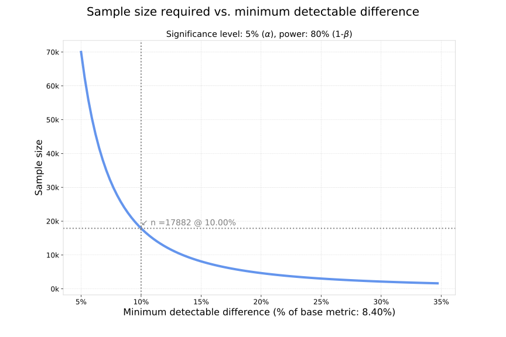

```
                            _    ____    _____         _
                           / \  | __ )  |_   _|__  ___| |_ ___ _ __
                          / _ \ |  _ \    | |/ _ \/ __| __/ _ \ '__|
                         / ___ \| |_) |   | |  __/\__ \ ||  __/ |
                        /_/   \_\____/    |_|\___||___/\__\___|_|
                           Some utilities for evaluating AB Tests
```
# What is an AB Test?
It's a user experience research methodology. It consists of a randomized experiment with two product variants: A and
B. The two variants are compared. From a business perspective, we would like to know if the performance of a certain
variant of a user's experience outperforms the other, thus helping the business achieve more effectively its goals
(i.e. increasing conversions, revenue, user engagement, etc). At the base of an AB test, [hypothesis testing](https://en.wikipedia.org/wiki/Statistical_hypothesis_testing) is used
(a statistical approach to inference).

# What is AB Tester (this package)? [WIP]
It's a set of utilities written on Python for evaluating AB Tests, like:
  - [ ] Sample size calculation by using different methodologies:
      - [X] Approximate approach by using n=16·σ²/Δ²
      - [X] Similar approach to the one used in R with the function `power.prop.test`
      - [X] Similar approach to the one used in the nice [Evan-Miller calculator](http://www.evanmiller.org/ab-testing/sample-size.html#!20;85;5;5;0)
      - [ ] Standford approach, [link](http://statweb.stanford.edu/~susan/courses/s141/hopower.pdf)
  - [ ] Graphical tools:
      - [X] Sample size vs. min detectable effect
      - [ ] Power vs. sample size

# How to use it?

## Finding the required sample size for an AB Test
  - We have an e-commerce that in it's current state, from each ~10k users, about 840 make a given action (for example
    buy a given item).
      - Performance measurement: 840 / 10000 = 8.4%
  - We would like to implement a new variant of the Web site and we would like to be able to
    measure if that new variant improves in ~10% our base performance measure.
  - What would be the required sample size for this AB test?

```python
# Imports the class ABTester (you can find the code in the file abtester.py)
from abtester import ABTester

# Input variant information A (control group)
A = dict(impressions=10e3, conversions=840)

# Initialize object ab_tester, defining significance at 5% and power of the test at 80%:
abtester = ABTester(A, significance=0.05, power=0.8)

 # The min_detectable_effect will be relative to the current conversion rate
abtester.get_sample_size(method='approx1', min_detectable_effect=0.1)
#     A minimum sample size of
#       n = 17448 is needed
#
#       to detect a change of 10% (relative) of a base proportion of 8.40%

abtester.get_sample_size(method='evan_miller', min_detectable_effect=0.1)
#    A minimum sample size of
#      n = 17347 is needed
#
#      to detect a change of 10% (relative) of a base proportion of 8.40%
#      with a power of 80%
#      and a significance level of 5.0%

abtester.get_sample_size(method='R', min_detectable_effect=0.1)
#     A minimum sample size of
#      n = 17882 is needed
#
#      to detect a change of 10% (relative) of a base proportion of 8.40%
#      with a power of 80%
#      and a significance level of 5.0%
```
Hence, for our Website we would implement the test and would need about ~17.8k observations in each branch (A, B) to
be able to measure a (relative) change of ~10% from a base conversion rate of 8.4% with a power of 80% and a
significance level of 5%.

### Required sample size as a function of the minimum detectable effect
The minimum detectable effect is the minimum change in the base metric that we want to be able to identify. The
smaller this value is the higher the resulting sample size would be. This could be visualized with the help of
AB Tester:
```python
A = dict(impressions=10e3, conversions=840)
abtester = ABTester(A, significance=0.05, power=0.8)
abtester.plot_sample_size_vs_diff(diff_range=(0.05, 0.35), steps=100, p_hat=None, method='R', desired_effect=0.1)
```
The following plot is created:

In the plot, the line represents the different sample sizes required as a function of the minimum detectable
difference for the given significance and power values defined in the moment of initialization of the ABTester
instance. In this case, it is required a sample size of 17882 for detecting an effect of 10%.


# Why has been this created?
This is just some tests I have been doing with the available functions in Python, and some AB Tests courses I have done.
I just compare, test, create functionality and put it in git so maybe it can be useful to anyone doing some AB Tests.
There are many more packages like this, which are also much more complete than this one, each one allows to test
different things (I will 'borrow' parts of their code here):
  - [pyAB](https://github.com/AdiVarma27/pyAB): it has some really nice charts!
  - [abracadabra](https://github.com/quizlet/abracadabra): nice charts, both frequentist and Bayesian approach
  - [ABTests](https://github.com/leodema/ABtests): has some ABTest reports
  - [abito](https://github.com/avito-tech/abito): offers the possibility to make bootstrap analysis
  - Bayesian approach:
      - [AByes](https://github.com/cbellei/abyes): Bayesian
      - [Babtest](https://github.com/tcassou/babtest)
  - Other resources:
      - [Google course on AB testing](https://www.udacity.com/course/ab-testing--ud257): has a nice introduction to the topic
      - [The math behind AB testing with code examples](https://towardsdatascience.com/the-math-behind-a-b-testing-with-example-code-part-1-of-2-7be752e1d06f)

So why to bother creating a new package? well for me it's more like 'learn by doing', that way I learn by testing,
hacking, copying, checking how it works, experiment, fail and improve. I also like programming in Python so creating a
nice python interface to this relatively complex topic seems like a nice hobby to me.

# Getting help
Just trigger the help command on the class or methods:
```python
help(ABTester)
#  class ABTester(builtins.object)
#     AB Tester is a set of utilities written on Python for evaluating AB Tests.
#     You can initialize the code like:
#
#     from abtester import ABTester
#     ab_tester = ABTester()
#
#     Methods defined here:
#
#     __init__(self, A, B=None, significance=0.05, power=0.8, two_sided=True)
#         Initializes the AB Tester object
#         Args:
#             - A:                  (dict)  dictionary with two key-values: "conversions" and "impressions" (both have int values)
#             - B:                  (dict or None)  dictionary with two key-values: "conversions" and "impressions" (both have int values)
#             - significance level: (float) alpha, default: 0.05 (5%)
#             - power:              (float) 1-beta, default: 0.8 (80%)
#             - two_sided:          (bool)  wheter a two-sided test is used or not, default True (two-sided)
#
#     get_sample_size(self, method='approx1', p_hat=None, min_detectable_effect=0.1)
#         Calls the calculation of the required sample size by using on of the available methods:
#          Args:
#             - method:       (string) Options: 'approx1', 'evan_miller', 'R', 'standford'
#             - p_hat:        (float or null) proportion, if None, the control variant A in initialization will be used
#             - min_detectable_effect:   (float) minimum detectable effect, relative to base conversion rate.
#         Returns:
#             - sample size   (float)
```
